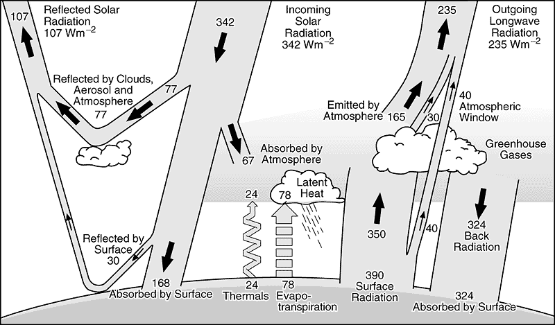

```{r global_options, include=FALSE}
  knitr::opts_chunk$set(fig.width=6, fig.height=4, fig.align="center", fig.path='Figs/',
                      echo=FALSE, warning=FALSE, message=FALSE, fig.pos = 'h')
```

```{r, echo=FALSE}
rm(list=ls())
# knitr::opts_chunk$set(echo = TRUE)
setwd('D:/Krishna/Acads/Q4/Ecophysiology/HW')
library(ggplot2)
library(reshape2)
library(latex2exp)
```
# Problem 1  

## Part a)   
Assumptions:  
  1. No exchange of water vapour through walls of hospital.  
  2. Temperature is uniform throughout the hospital
  3. Water vapour is assumed to an ideal gas (for Clausius Clapeyron equation to be valid.)  
  4. Latent heat of vaporization is independent of temperature.  
  
For outside environment, T = -6.7 $C^\circ$  
Saturation vapor pressure is given by  
$$e^*(T) = 6.1094e^{\frac{17.625T}{T+243.04}}$$
$$e^*(-6.7) = 3.706 hPa$$
By definition of relative humidity  
$$RH = 0.9 = \frac{e}{e^*}$$
$$\therefore e = 0.9*3.706 = 3.335 hPa$$
To estimate indoor relative humidity, we have  
$$e^*(20.6) = 24.24 hPa$$
$$\therefore RH = \frac{3.35}{24.24} \approx 0.138 \quad or\quad  13.8\%$$
  
## Part b)   

Assumptions:  
  1. Density of air is constant irrespective of humidity or mass of water in air is negligible as compared to mass of dry air per unit volume of moist air.    
  2. Hospital building is maintained at constant pressure.  
  3. Air is an ideal gas  
  4. System is well mixed at all times.  
  5. Mass of water = 1Kg/l
  

At present state,  
Specific humidity in the building is given by (1mb = 1hPa)  :   
$$q = \frac{0.622e}{P-0.378e}\ =\ \frac{0.622* 3.35hPa}{1000mb-0.378*2.25 hPa}\ =\ 0.0021 $$
$\therefore$ mass of water in air $m_w = q*m_a = q*\rho*V\ = 0.0021*1.2*1500\ = 3.78\ Kg$  

At desired state,  
$$e=RH \times e^*(20.6)\ =\ 0.75\times24.24\ = \ 18.18\ hPa$$
$$q = \frac{0.622e}{P-0.378e}\ =\ \frac{0.622* 18.18hPa}{1000mb-0.378*18.18 hPa}\ =\ 0.0114$$
$\therefore$ mass of water in air $m_w = q*m_a = q*\rho*V\ = 0.0114*1.2*1500\ = 20.50\ Kg$  
mass of water to be added = 20.52 - 3.78 = 16.74 Kg  
Time taken by humidier to increase relative humidity to desired level = $$\frac{16.74 Kg}{4\ l/hr}\ = \frac{16.74 Kg}{4\ Kg/hr}\ \approx 4.18\ hours\ or\ 4\ hours\ and\ 12\ minutes\    $$   


# Problem 2  

## Part a)  

```{r, echo=FALSE}
df=read.csv('Vaira_Aug102006.csv')
colnames(df)=c('hour','Rnet_Aug','Bowen_Aug')
df2=read.csv('Vaira_May022006.csv')
colnames(df2)=c('hour','Rnet_May','Bowen_May')
df=cbind.data.frame(df['Rnet_Aug'],df['hour'],df2['Rnet_May'])
df=melt(df,id.vars='hour')
g=ggplot(df,aes(hour,value,linetype=variable))
g+geom_line(size=2)+
  labs(x='Hour of day',y='Net Radiation W/m2',title='Diurnal variation of net radiation, Vaira')+
  theme(plot.title = element_text(hjust = 0.5),text = element_text(size=15))
```

$$R_{net} = {Shortwave}^{in} - Shortwave^{out} + Longwave^{in} - Longwave^{out}  $$
During day time, Shortwave incoming radiation dominates the equation thus making $R_{net}$ positive.  
During night time, radiation from the sun is absent. The only non-zero quantity in the equation is outward Longwave radiation emitted by the warm surface of Earth.  

## Part b)  
$$R_{net} = H + LE +G$$
$$R_{net} = H + LE +0.1R_{net}$$
$$0.9*R_{net} = H + LE$$
$$0.9*\frac{R_{net}}{LE} = \frac{H}{LE}+1$$
$$0.9*\frac{R_{net}}{LE} = Bo+1$$
$${LE} = 0.9*\frac{R_{net}}{Bo+1}$$
```{r, echo=FALSE}
df=read.csv('Vaira_Aug102006.csv')
colnames(df)=c('hour','Rnet_Aug','Bowen_Aug')
df['LE_Aug']=0.9*df$Rnet_Aug/(df$Bowen_Aug+1)
df2=read.csv('Vaira_May022006.csv')
colnames(df2)=c('hour','Rnet_May','Bowen_May')
df2['LE_May']=0.9*df2$Rnet_May/(df2$Bowen_May+1)
df=cbind.data.frame(df['LE_Aug'],df['hour'],df2['LE_May'])
df=melt(df,id.vars='hour')
g=ggplot(df,aes(hour,value,linetype=variable))
g+geom_line(size=2)+
  labs(x='Hour of day',y='Latent Heat Flux W/m2',title='Diurnal variation of Latent Heat Flux, Vaira')+
  theme(plot.title = element_text(hjust = 0.5),text = element_text(size=15))
```

The latent heat flux is drastically different for the two days. This may be due to the fact that May is one of the first summer months in California. The ground condition may have ben wet/moist due to which most of the net radiation goes to convert water into water vapour. This results in a high latent heat flux. On the other hand, in the month of August which is towards the end of Summer, the land would have been completely dried up leaving no moisture to convert radiation into latent heat. Thus most of the net radiation goes into heating up the land and atmosphere in the form of sensible heat. 

## Part c)
Since the Tonzi ranch is just a few miles away, moisture conditions in both areas can be assumed to be similar.  
With that assumption,  

* In the month of May, Tonzi Ranch is expected to have higher net radiation because:  
    1. Outgoing shortwave radiation is expected to be slightly lesser than that in a grassland because of interception of relected sunlight by denser vegetation.  
    2. Outgoing longwave radiation is expected to be lesser than that in a grassland, because on the whole, land near the denser vegetation area will be cooler.  

* In the month of Aug, Tonzi Ranch is still expected to have higher net radiation due to the reasons mentioned above. However, the magnitude of difference would be lesser than that in May due to decreased net radation in August.   

## Part d)  

* Air temperature is expected to be lower in Tonzi because of interception of reflected shortwave radiation and surface emitted long wave radiation. In Vaira grassland, since there is no interception, this radiation would heat up the air, thus increasing the temperature.  

* Tonzi ranch is expected to have higher specific humidity because shurbs and sparse trees are more effective in taking in water through their roots (due to root depth) and evaporating it through their leaves (due to increased surface area) into the air.  

* Processes leading to these differences are transpiration, photosynthesis and capillary action.  
  
  
# Problem 3  

{'style="float:right;"'}

Figure 1: Earth’s annual mean global energy budget, Bonan, p. 47  

From the figure above, it can be seen that approximately only 20% of the radation leaving the planet comes directly from the surface (70 W/m2 out of 342 W/m2). Rest of the ougoing energy is from:  

  1. Radiation reflected by clouds = 77W/m2  
  2. Radiation emitted by atmosphere = 165 W/m2  
  3. Radiation emitter by clouds = 30 W/m2  
  
The latent heat exchanged at the surface is stored in the atmosphere temperorily in the form of clouds. When clouds precipitate, the latent heat is released again into the atmosphere, part of which finds its way into outer space.  

# Problem 4 
## Part a)
Linear Fit between each of the net fluxes plotted below in thick solid lines.  
Shaded grey region shows 95% confidence intervals.  
```{r, echo=FALSE}
df=read.csv('GCP.csv')
fit=lm(F_land~cCO2,data=df)
xaxis=data.frame(cCO2=df$cCO2)
pred=data.frame(predict(fit,new_data=xaxis,interval='confidence'))
g=ggplot(df,aes(cCO2,F_land))
g+geom_point(size=2)+
  geom_abline(slope=fit$coefficients[2],intercept=fit$coefficients[1],size=2)+
  geom_ribbon(ymin= pred$lwr, ymax= pred$upr, alpha = 0.3)+
  labs(x=TeX('Average CO_2 concentration (ppm)'),y=TeX('F_{LAND} (Gt C/yr)'),parse=TRUE, title=TeX('F_{land} as a function of CO_2 concentration'))+
  annotate('text',x=380,y=0.75,label=TeX('F_{LAND}= -4.35 + 0.02cCO_2',output='character'),size=6,parse=T)+
    theme(plot.title = element_text(hjust = 0.5),text = element_text(size=15))
fit=lm(F_LUC~cCO2,data=df)
xaxis=data.frame(cCO2=df$cCO2)
pred=data.frame(predict(fit,new_data=xaxis,interval='confidence'))
g=ggplot(df,aes(cCO2,F_LUC))
g+geom_point(size=2)+
  geom_abline(slope=fit$coefficients[2],intercept=fit$coefficients[1],size=2)+
  geom_ribbon(ymin= pred$lwr, ymax= pred$upr, alpha = 0.3)+
  labs(x=TeX('Average CO_2 concentration (ppm)'),y=TeX('F_{LUC} (Gt C/yr)'),parse=TRUE, titleR=TeX('F_{LUC} as a function of CO_2 concentration'))+
  annotate('text',x=380,y=0.75,label=TeX('F_{LUC}= 3.60 - 0.01cCO_2',output='character'),size=6,parse=T)+
  theme(plot.title = element_text(hjust = 0.5),text = element_text(size=15))
```
  
* Cause and Effect Relationships:  

  1. Increase in terrestrial uptake of $CO_2$ will decrease the available carbon in the atmosphere as seen from the simplified differential equation given in the question. At the same time, terrestrial uptake of $CO_2$ is governed by net biome production (NBP), which is the balance of net primary production (NPP) and carbon losses due to heterotrophic respiration (decomposition and herbivorous) and fire. NPP increases when atmospheric $CO_2$ concentration is increased. But increase in atmospheric $CO_2$ also causes warming which increases the rate of heterotrophic respiration on land. Thus, it is difficult to tell whether change in atmospheric $CO_2$ levels is causing change in terrestrial uptake or change in terrestrial uptake is causing change in carbon. What we do know is that there is a strong relationship between the two.  
  2. Land use change has a direct impact on atmospheric $CO_2$ because changes in land use and management affect the amount of carbon in plant biomass and soils. For example, if a forested land is converted into grassland, there will be a net emission of carbon because amount of carbon in grass is less than that in forest for the same land area. Thus landuse change alters atmospheric $CO_2$ levels. There is a feedback loop here though. Once a change is introduced in atmospheric levels of $CO_2$ further disturbances may be caused to landuse due to altering climate. Thus, here too it is difficult to establish a clear cause and effect relationship.      

* A perfect linear regression is not possible owing to:  
    1. Uncertainty in estimation of flux  
    2. Feedback loops between fluxes and carbon concentration  
    3. Interaction between terrestrial and ocean processes  

## Part b)  
During steady state, $\frac{dC}{dT} = 0$ and if E is ignored, $F_{LUC} = F_{LAND}$  
$$\therefore\ 3.6023 - 0.0065c = -4.3492 + 0.0184c$$
$$\therefore c \approx 320\ ppm$$

## Part c)  
Average pre-industrial $CO_2$ concentrations were less than the answer obtained in b. This means that some term may be missing in the carbon balance equation. While calculating steady state carbon concentration, we have ignored:  
  1. Anthropogenic emissions from burned fossil, cement production and so on. Accounting for this will increase steady state carbon concentration.    
  2. Ocean uptake of $CO_2$. Uptake of carbon by the ocean is driven by the atmosphere-ocean difference in partial pressure of $CO_2$. Inclusion of this term will slightly reduce steady state carbon concentration.    

## Part d)  
During steady state, $\frac{dC}{dT} = 0$  
E in 2015 = 9.90 Gt C/yr  
$$\therefore 0 = 9.90 + 3.6023 - 0.0065c + 4.3492 - 0.0184c -0.02c + 5.10$$
$$\therefore c \approx 511\ ppm$$


