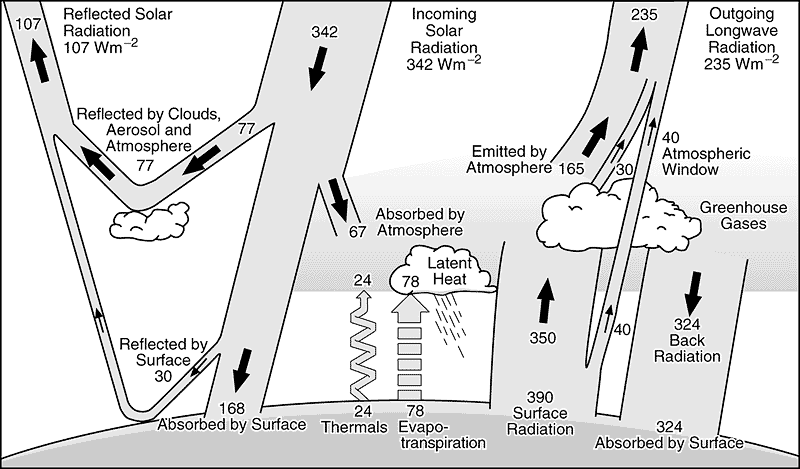

```{r global_options, echo=FALSE}
  knitr::opts_chunk$set(fig.width=5, fig.height=5,
                        fig.align="center", fig.path='Figs/', warning=FALSE,
                        message=FALSE, fig.pos = 'h', 
                        tidy.opts=list(width.cutoff=60),tidy=TRUE)
  
```

```{r ,echo=FALSE}
rm(list=ls())
setwd('D:/Krishna/Acads/Q4/Ecophysiology/HW')
library(ggplot2)
library(reshape2)
library(latex2exp)
library(knitr)
theme=theme_light()+theme(plot.title = element_text(hjust = 0.5),text = element_text(size=7))
cif=1.5
ty=1
source('Pset3_metloop_improved.R')
```

# Part 1.  
<!-- {'style="float:right;"'} -->

# Part 2.  
```{r}
Sys.setenv(TZ='America/Manaus')
df.m<- melt(met[met$date<"1983-09-05" ,c('date','Rn','LE','H')],'date')
g=ggplot(df.m, aes(date, value, colour = variable))
g+ geom_line(size=1) + labs(y=TeX('W.m^{-2}'),title='Radiation Components, Manaus')+theme
```

# Part 3.  
```{r}
g=ggplot(met[met$date<"1983-09-05",], aes(date, A))
g+ geom_line(size=1) + labs(y=TeX('Photosynthesis ($\\mu$mol. m^{-2}s^{-1})'),title='Photosynthesis variation, Manaus')+theme
```


# Part 4.  
```{r}
df=data.frame()
for (cif in seq(4)){
  source('Pset3_metloop_improved.R')
  met$cif=factor(cif)
  df=rbind(df,met[met$date<"1983-09-05" ,c('date','Rn','LE','H','cif')])
}
g=ggplot(df, aes(date, Rn,group=cif,color=cif))
g+ geom_line(size=1) +
  labs(y=TeX('R_n\ W.m^{-2}'),title='Net Radiation for varying vegetation density, Manaus')+
  theme

```
```{r}
df=data.frame()
cif=1.5
for (ty in c(1,2,6,9)){
  source('Pset3_metloop_improved.R')
  met$ty=factor(ty)
  df=rbind(df,met[met$date<"1983-09-05" ,c('date','Rn','LE','H','ty')])
}
g=ggplot(df, aes(date, Rn,group=ty,color=ty))
g+ geom_line(size=1) +
  labs(y=TeX('R_n\ W.m^{-2}'),title='Net Radiation for varying vegetation type, Manaus')+
  theme
```
